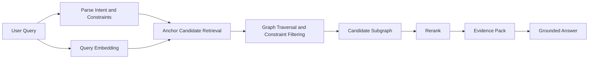

# NexTripAI-KB GraphRAG Workflow

Repo nay la GraphRAG research lab cua NexTripAI. Moi KB version phai bao gom day du:

- data contract va validation.
- ontology/schema.
- cach tao node va edge.
- retrieval units va embedding strategy.
- indexes.
- retrieval/traversal/reranking.
- evidence contract.
- benchmark va failure report.

Chi doi retrieval algorithm thi chi la retrieval experiment, khong duoc goi la mot GraphRAG version moi.

## 1. Scope

- Source of truth: `travel_data_verified/`, 692 places.
- Cities: Da Nang va Quy Nhon.
- Graph DB: Neo4j local.
- Embedding/generation: Gemini Developer API, co cache va resume o target V2.
- KB tra candidates, graph paths va evidence; BE phu trach hoi thoai, weather orchestration va itinerary.

## 2. Hai Pipeline Khac Nhau

GraphRAG co mot pipeline offline de xay index va mot pipeline online de query. Khong tron hai pipeline nay.

### 2.1 Offline Indexing Pipeline

```mermaid
flowchart LR
    A[travel_data_verified] --> B[Validate and Normalize]
    B --> C[Ontology and Graph Schema]
    C --> D[Build Nodes]
    D --> E[Build Edges]
    E --> F[Build Retrieval Units]
    F --> G[Generate Embeddings]
    G --> H[Create Fulltext and Vector Indexes]
    H --> I[Graph Quality Checks]
    I --> J[Version Manifest and Benchmark Ready]
```



Thu tu dung voi structured travel data:

1. Validate 692 verified records.
2. Chot ontology cua version.
3. Tao nodes va edges theo ontology.
4. Tao text dai dien cho node/chunk can retrieve.
5. Embed retrieval units va luu embedding.
6. Tao vector/fulltext indexes dung dimension.
7. Kiem tra graph count, orphan nodes, duplicate entities, missing edges va embedding coverage.

Embedding khong phai buoc dau tien cua indexing. Phai biet node/chunk nao can embed va text dai dien cua no truoc.

### 2.2 Online Query Pipeline



Thu tu query:

1. Parse city, place type, category, budget, audience, weather, indoor/outdoor va near-place constraints.
2. Embed user query neu graph version co vector index san sang.
3. Hybrid retrieve anchor nodes bang exact/fulltext/vector.
4. Tu anchor, traverse edges de lay facets, evidence, source va nearby places.
5. Filter/rerank theo constraint coverage, semantic score, quality va distance.
6. Tra candidate kem path va source; LLM chi sinh answer tu evidence nay.

## 3. V1 Dang Xay Graph Nhu The Nao

V1 nodes:

- `City`
- `Place` voi subtype labels `Attraction`, `Cafe`, `Hotel`, `Nightlife`, `Restaurant`
- `PlaceType`
- `Category`
- `Source`
- `Term` voi secondary labels nhu `Cuisine`, `Amenity`, `Audience`, `Weather`

V1 edges:

- `City-[:HAS_PLACE]->Place`
- `Place-[:IN_CITY]->City`
- `Place-[:HAS_TYPE]->PlaceType`
- `Place-[:HAS_CATEGORY]->Category`
- `Place-[:FROM_SOURCE]->Source`
- `Place-[:HAS_CUISINE|HAS_AMENITY|SUITABLE_FOR|SUITABLE_WEATHER|...]->Term`
- `Place-[:NEAR]->Place`

V1 query:

```txt
query embedding -> vector search
  if no vector result -> keyword search
  -> optional shallow facet/nearby expansion
  -> answer
```

## 4. Vi Sao V1 Yeu

### 4.1 Runtime chua co embeddings

Neo4j co 519 places nhung `0/519` nodes co embedding. V1 van goi query embedding, vector search tra 0, sau do moi fallback keyword. Vi vay demo vua cham vua thuc te la lexical search.

### 4.2 Graph khong drive retrieval

V1 chon place bang vector/keyword truoc. Cac edge weather, audience, cuisine va nearby chi duoc mo rong sau retrieval, nen edge dung van khong cuu duoc candidate sai.

Vi du `dia diem trong nha khi troi mua` bi lexical match vao `Gieng Troi` va outdoor attractions, trong khi graph da co `is_indoor` va `SUITABLE_WEATHER`.

### 4.3 Ontology con phang

- Qua nhieu semantics gom vao generic `Term`.
- Chua co schema patterns ro rang cho tung source/relationship/target.
- Chua co provenance node o muc record/chunk/claim.
- Edge khong co `source`, `confidence`, `version` hoac `construction_method`.
- `NEAR` phu thuoc data khai bao san, chua sinh dong nhat tu toa do.

### 4.4 Retrieval unit chua ro

V1 embed mot `search_text` lon tren `Place`. Chua tach:

- place profile cho recommendation.
- factual/source chunk cho answer grounding.
- graph summary cho broad query.

### 4.5 Ingestion khong resilient

Embedding load chua cache/resume. Gemini API quota `429` lam ca load dung va graph van khong co embeddings.

### 4.6 Evaluation con nho

Benchmark hien tai moi co 6 smoke cases L1-L3. Chua du de ket luan V1/V2 tren toan bo travel query distribution.

## 5. V2 Target - Rebuild GraphRAG

V2 khong chi sua retriever. V2 se tao graph moi trong namespace/database rieng hoac dung `graph_version: v2` de demo song song voi V1.

### 5.1 V2 Node Model

```txt
(:City)
(:Place:Attraction|Cafe|Hotel|Nightlife|Restaurant)
(:Category)
(:Cuisine)
(:Amenity)
(:Audience)
(:WeatherCondition)
(:ActivityFeature)
(:SourceRecord)
(:EvidenceChunk)
```

Khong dung generic `Term` lam contract chinh. Moi retrieval-driving concept co label va meaning ro rang.

### 5.2 V2 Edge Model

```txt
(Place)-[:LOCATED_IN]->(City)
(Place)-[:HAS_CATEGORY]->(Category)
(Place)-[:SERVES_CUISINE]->(Cuisine)
(Place)-[:HAS_AMENITY]->(Amenity)
(Place)-[:SUITABLE_FOR]->(Audience)
(Place)-[:SUITABLE_IN]->(WeatherCondition)
(Place)-[:HAS_FEATURE]->(ActivityFeature)
(Place)-[:NEAR {distance_km, method, version}]->(Place)
(Place)-[:SUPPORTED_BY]->(SourceRecord)
(SourceRecord)-[:HAS_CHUNK]->(EvidenceChunk)
(EvidenceChunk)-[:MENTIONS]->(Place)
```

### 5.3 V2 Embedding Units

- `Place.profile_embedding`: name + city + category + curated description + retrieval-driving facets.
- `EvidenceChunk.embedding`: source text dung de grounding factual answer.
- Khong embed raw JSON hoac field noise.
- Luu `embedding_model`, `embedding_dim`, `embedding_hash`, `embedded_at`.
- Cache theo content hash va resume theo batch.

### 5.4 V2 Retrieval

```txt
structured constraints
  + exact/fulltext search
  + query embedding -> Place/Chunk anchors
  -> graph traversal
  -> constraint-aware rerank
  -> evidence paths
```

Response moi candidate phai co:

- `place_id`
- `final_score`
- `component_scores`
- `matched_constraints`
- `graph_paths`
- `evidence_chunks`
- `source`
- `graph_version`
- `embedding_version`

## 6. Version Research Roadmap

| Version | Graph construction | Embedding | Retrieval |
| --- | --- | --- | --- |
| V1 | Place-centric + generic Term | One Place search text | Vector-first, keyword fallback |
| V2 | Typed travel ontology + provenance chunks | Place profile + evidence chunk | Hybrid anchors + graph traversal + rerank |
| V3 | V2 + entity resolution/claim confidence | Multi-vector profiles | Query-adaptive graph-first retrieval |
| V4 | V3 + generated geo edges/time constraints | Geo/context summaries | Geo-aware itinerary candidate retrieval |
| V5 | V4 + communities/summary nodes | Local + community summaries | Adaptive local/global GraphRAG |

## 7. Build And Compare Rule

Moi version phai chay theo loop:

```txt
freeze manifest
-> build graph from travel_data_verified
-> embed/index
-> validate graph
-> run same benchmark
-> inspect failures
-> publish report
```

Khong sua graph V1 de bien no thanh V2. V1 va V2 phai co the demo song song va co manifest rieng.

## 8. Current Commands

```powershell
python -m nextrip_graphrag prepare --data-dir travel_data_verified --out-dir processed_verified
python -m nextrip_graphrag schema
python -m nextrip_graphrag load --processed-dir processed_verified
python -m nextrip_graphrag load --processed-dir processed_verified --with-embeddings
python -m nextrip_graphrag benchmark --strategy v1
```

Lenh V2 target sau khi builder duoc implement:

```powershell
python -m nextrip_graphrag build --kb-version v2 --data-dir travel_data_verified
python -m nextrip_graphrag validate-graph --kb-version v2
python -m nextrip_graphrag benchmark --kb-version v2
```

## 9. Boundary Voi BE

KB thuc hien graph construction, embedding, retrieval, traversal, rerank va evidence. BE khong query Neo4j truc tiep; BE chi gui user constraints cho KB va dung candidates/evidence de hoi lai user, lay weather hoac lap itinerary.
