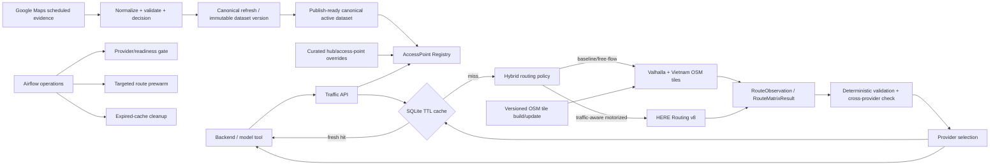

# NexTrip traffic pipeline: Valhalla + HERE

## Mục tiêu

Traffic là một dịch vụ dữ liệu động của NexTrip KB. Nó nhận `place_id` hoặc
`city_id`, tính quãng đường theo mạng lưới đường thực tế, thời gian di chuyển và
trả provenance đủ rõ để model bên ngoài lập lịch trình. Traffic không tự lập
itinerary và không ghi kết quả có TTL ngắn vào Neo4j.

Hai provider có vai trò khác nhau:

- **Valhalla self-host** dùng dữ liệu OpenStreetMap làm tuyến nền/free-flow và
  fallback không phụ thuộc quota HERE.
- **HERE Routing v8** cung cấp thời gian có traffic cho `drive` và
  `two_wheeler` khi request cần dữ liệu hiện tại hoặc dự báo.

Valhalla không được gắn nhãn realtime nếu deployment chưa có một traffic feed
được chứng minh ở cấp route.

## Kiến trúc tổng thể



## Luồng request online

1. Resolve `origin_id` và `destination_id` thành access point đã verify. Registry
   nhận trực tiếp `place_id`, `city_id` hoặc canonical access-point ID.
2. Tạo cache key theo endpoint, mode, traffic preference, provider hint,
   baseline option và bucket giờ khởi hành.
3. Với request motorized mặc định, HERE và Valhalla chạy song song:
   - HERE là candidate traffic-aware;
   - Valhalla là baseline free-flow để đối chiếu và fallback.
4. Chuẩn hóa cả hai về schema chung, kiểm tra binding endpoint, lower-bound
   khoảng cách, duration bất thường, expiry và độ lệch giữa provider.
5. Chọn kết quả:
   - HERE hợp lệ: trả HERE, có thể kèm Valhalla baseline;
   - HERE lỗi với `traffic_aware_preferred`: trả Valhalla, đặt
     `provider_role=fallback`, `traffic_basis=free_flow`, `degraded=true`;
   - HERE lỗi với `traffic_aware_required`: trả lỗi, không giả realtime;
   - `free_flow`, `walk`, `bicycle`: dùng Valhalla.
6. Chỉ kết quả qua validation mới được cache. Traffic-aware mặc định có TTL
   10 phút; free-flow mặc định có TTL 24 giờ. Stale fallback bị giới hạn và
   không được dùng cho `traffic_aware_required`.

| Request | Provider chính | Baseline/fallback | Cam kết |
|---|---|---|---|
| `drive`, `two_wheeler` + `traffic_aware_preferred` | HERE | Valhalla | fallback có nhãn free-flow/degraded |
| `drive`, `two_wheeler` + `traffic_aware_required` | HERE | không fallback | lỗi nếu HERE không đáp ứng |
| `free_flow` | Valhalla | không cần HERE | không claim realtime |
| `walk`, `bicycle` | Valhalla mặc định | — | road-network route |
| `transit` | chưa hỗ trợ | — | cần nguồn timetable/GTFS riêng |

## Access point và dữ liệu đầu vào

Trong production, registry đọc đúng immutable artifact được chọn bởi
`NEXTRIP_CANONICAL_DATASET`. Chỉ active record trong publish-ready canonical
dataset được project thành access point; vì vậy traffic, Neo4j và các data API
dùng cùng một tập identity/place. Canonical dataset là bắt buộc và registry
không còn nhận input place legacy. Các place thiếu tọa độ bị loại khỏi registry
thay vì tự bịa lat/lng.

Deployment không mount `data/current/place`. Traffic API và Airflow chỉ mount
`data/canonical` ở chế độ read-only và đều fail khi thiếu
`NEXTRIP_CANONICAL_DATASET`; vì vậy không có nguồn place fallback khi canonical
dataset lỗi.

Ngoài entrance chính của place, registry tạo hai alias thành phố:

- `city_quy_nhon` → `city:city_quy_nhon:center`
- `city_da_nang` → `city:city_da_nang:center`

City center mặc định là median có provenance từ các place đã verify. Với bến
xe, sân bay, ga tàu hoặc hotel drop-off chính xác hơn, thêm record curated vào
`config/traffic-access-points.json`; override không làm thay đổi canonical
dataset.

## API

Liveness `GET /health` không khởi tạo provider. Readiness `GET /ready` kiểm tra
registry và Valhalla. Các endpoint dữ liệu:

- `POST /routes`
- `POST /transport-recommendations`
- `GET /routes/{observation_id}`
- `POST /matrix`
- `GET /matrix/{matrix_id}`
- `GET /access-points`
- `GET /access-points/stats`
- `GET /access-points/{identifier}`
- `GET /providers/health`

Nếu `TRAFFIC_API_KEY` được cấu hình, endpoint dữ liệu yêu cầu header
`X-NexTrip-Traffic-Key`; liveness/readiness vẫn phục vụ health check nội bộ.

Ví dụ route Quy Nhơn → Đà Nẵng:

```json
{
  "origin_id": "city_quy_nhon",
  "destination_id": "city_da_nang",
  "mode": "drive",
  "departure_time": "2026-08-20T08:00:00+07:00",
  "traffic_preference": "traffic_aware_preferred",
  "include_baseline": true
}
```

`RouteObservation` trả `distance_meters`, `duration_seconds`, geometry,
`traffic_basis`, provider/request provenance, `observed_at` và `expires_at`.
Model lập lịch trình phải đọc `traffic_basis`, `degraded` và freshness, không chỉ
đọc duration.

### Gợi ý phương tiện

`POST /transport-recommendations` nhận cùng loại `place_id`, `city_id` hoặc
access-point ID như `/routes`, tính các mode đường bộ được yêu cầu rồi trả một
khuyến nghị có thể giải thích. Endpoint chỉ chọn phương tiện cho một cặp điểm;
nó không tự lập itinerary và không suy diễn lịch xe khách, tàu hoặc chuyến bay.

Request mặc định xét `walk`, `bicycle`, `two_wheeler`, `drive` với các ngưỡng:

| Mode | Ngưỡng mặc định | Khi vượt ngưỡng |
|---|---:|---|
| `walk` | 1.800 giây (30 phút) | `ineligible`, `walk_duration_exceeds_limit` |
| `bicycle` | 3.600 giây (60 phút) | `ineligible`, `bicycle_duration_exceeds_limit` |
| `two_wheeler` | 80.000 m (80 km) | `ineligible`, `two_wheeler_distance_exceeds_limit` |
| `drive` | không có | vẫn được xét nếu route thành công |

API có thể truyền `null` cho một ngưỡng để tắt riêng ngưỡng đó. Giá trị bằng
đúng ngưỡng vẫn hợp lệ; chỉ giá trị lớn hơn mới bị loại. Các option hợp lệ được
xếp theo `generalized_duration_seconds`, sau đó lần lượt theo duration thực,
distance và thứ tự ổn định `walk`, `bicycle`, `two_wheeler`, `drive`.

Hai objective có ý nghĩa khác nhau:

- `fastest`: `generalized_duration_seconds = duration_seconds`; chọn ETA route
  thấp nhất.
- `balanced` (mặc định): cộng overhead cố định để biểu diễn thời gian/ma sát
  chuẩn bị, lấy xe và đỗ xe: `walk +0`, `bicycle +240`, `two_wheeler +360`,
  `drive +600` giây. Overhead chỉ dùng để xếp hạng, không được cộng vào
  `route.duration_seconds` hay trình bày như dữ liệu traffic đo được.

Ví dụ request:

```json
{
  "origin_id": "cafe_dn_062",
  "destination_id": "attr_dn_001",
  "candidate_modes": ["walk", "bicycle", "two_wheeler", "drive"],
  "objective": "balanced",
  "departure_time": "2026-08-20T08:00:00+07:00",
  "motorized_traffic_preference": "traffic_aware_preferred",
  "max_walk_duration_seconds": 1800,
  "max_bicycle_duration_seconds": 3600,
  "max_two_wheeler_distance_meters": 80000,
  "include_baseline": false
}
```

Response trả `request_id`, access point `origin`/`destination`, `objective`,
`status`, `recommended_mode`, `selection_reason`, `computed_at`, `degraded`,
`partial` và toàn bộ `options`. Mỗi option giữ `mode`, `status`, distance,
duration, generalized duration, `rank`, cờ `recommended`, `reason_codes` và một
`route` đầy đủ; option lỗi còn có `error_code`/`error_detail`. Chỉ option
`eligible` có rank; các trạng thái khác giữ `rank=null`. Ví dụ rút gọn:

```json
{
  "objective": "balanced",
  "status": "recommended",
  "recommended_mode": "two_wheeler",
  "selection_reason": "balanced_generalized_duration",
  "degraded": false,
  "partial": false,
  "options": [
    {
      "mode": "two_wheeler",
      "status": "eligible",
      "distance_meters": 3300,
      "duration_seconds": 432,
      "generalized_duration_seconds": 792,
      "rank": 1,
      "recommended": true,
      "reason_codes": [
        "route_available",
        "within_configured_limits",
        "balanced_mode_overhead_applied",
        "lowest_generalized_duration"
      ]
    }
  ]
}
```

`status` là `recommended` khi còn ít nhất một option hợp lệ,
`no_eligible_mode` khi route có nhưng đều vượt constraint (hoặc không mode nào
được cả hai endpoint hỗ trợ), và `no_route_available` khi không candidate nào
tạo được route. Một mode lỗi không làm hỏng toàn request: nó được giữ với
`status=failed`, `route_computation_failed`, còn các mode khác vẫn được xét.

`partial=true` nghĩa là có ít nhất một option `failed` hoặc `unsupported`; vì
vậy chỉ cần yêu cầu `transit` ở thời điểm hiện tại cũng làm response partial.
Một option chỉ bị `ineligible` vì constraint không làm response partial.
`degraded=true` nghĩa là route được khuyến nghị là fallback/stale/degraded; nếu
không có khuyến nghị thì nó phản ánh bất kỳ route trả về nào bị degraded. Hai cờ
này độc lập, vì vậy client phải đọc cả hai và provenance trong `options[].route`.

Provider policy và chi phí request được giới hạn theo mode:

| Mode | Chính sách route con |
|---|---|
| `walk`, `bicycle` | Valhalla `free_flow`, không tạo baseline phụ |
| `two_wheeler`, `drive` | dùng `motorized_traffic_preference`; mặc định HERE traffic-aware + Valhalla baseline/fallback |
| `transit` | `unsupported`, reason `transit_provider_not_configured`; không gọi provider |

Với cache lạnh và bốn road mode mặc định, một recommendation gọi tối đa 2 route
HERE và 4 route Valhalla. `include_baseline=false` chỉ không nhúng baseline vào
response motorized; Valhalla vẫn được gọi để validation/fallback của hybrid.
Nếu chọn `motorized_traffic_preference=free_flow`, cả bốn mode đường bộ dùng
Valhalla và không gọi HERE. Khi dùng `traffic_aware_required`, lỗi HERE làm mode
motorized tương ứng thành `failed`, nhưng `walk`/`bicycle` vẫn có thể được chọn.

Recommendation không có cache riêng. Service gọi `route()` nội bộ theo từng
mode và dùng các snapshot route còn fresh, nên đổi objective hoặc constraint có
thể xếp hạng lại mà không phát sinh provider call. Cache key route vẫn phụ thuộc
endpoint đã resolve, mode, traffic preference, provider hint, baseline option và
bucket giờ khởi hành; request phải khớp các chiều đó mới reuse được cache. Route
free-flow không có departure bucket; traffic-aware mặc định dùng bucket 5 phút.
`force_refresh=true` được truyền xuống mọi mode và bỏ qua fresh cache;
`allow_stale_on_error` cũng được truyền xuống, còn stale fallback luôn làm route
đó degraded.

## CLI local

```powershell
python -m nextrip_traffic.cli list-access-points
python -m nextrip_traffic.cli provider-health --require valhalla
python -m nextrip_traffic.cli route city_quy_nhon city_da_nang --mode drive --traffic-preference traffic_aware_preferred
python -m nextrip_traffic.cli recommend-transport cafe_dn_062 attr_dn_001 --objective balanced --modes walk bicycle two_wheeler drive
python -m nextrip_traffic.cli matrix --origins city_quy_nhon --destinations city_da_nang --mode drive
python -m nextrip_traffic.cli serve --host 127.0.0.1 --port 8010 --reload
```

`recommend-transport` dùng đơn vị thân thiện ở CLI: `--max-walk-minutes`,
`--max-bicycle-minutes`, `--max-two-wheeler-km`; service chuyển chúng về giây và
mét trong request. Có thể chọn `--objective fastest`, giới hạn `--modes`, đổi
`--motorized-traffic-preference`, và dùng `--force-refresh`,
`--include-baseline`/`--no-include-baseline` và
`--allow-stale-on-error`/`--no-allow-stale-on-error` giống policy API. Ví dụ:

```powershell
python -m nextrip_traffic.cli recommend-transport cafe_dn_062 attr_dn_001 --objective fastest --max-walk-minutes 20 --max-bicycle-minutes 45 --max-two-wheeler-km 30 --no-include-baseline
```

Không có `HERE_API_KEY`, request mặc định vẫn có thể trả Valhalla free-flow với
trạng thái degraded. Request `traffic_aware_required` sẽ thất bại đúng contract.

## Runtime Docker

Deployment nằm trong `deploy/traffic/`. Valhalla dùng image chính thức được pin
cả version và digest; tile build đọc Vietnam OSM PBF từ persistent volume. API
và Airflow không tải PBF trong lúc xử lý request.

```powershell
Copy-Item deploy\traffic\traffic.env.example deploy\traffic\.env
# Điền NEXTRIP_CANONICAL_DATASET, HERE_API_KEY và TRAFFIC_API_KEY trong file local;
# không commit secret.

# Tải/copy một Vietnam .osm.pbf về máy, tính checksum rồi chuẩn bị version bất biến.
$pbf = "C:\data\vietnam-latest.osm.pbf"
$sha = (Get-FileHash -LiteralPath $pbf -Algorithm SHA256).Hash
.\deploy\traffic\prepare-valhalla-data.ps1 `
  -PbfPath $pbf `
  -DatasetVersion "vietnam-2026-08-19" `
  -Sha256 $sha

docker-compose --env-file deploy\traffic\.env -f deploy\traffic\compose.yaml up -d
Invoke-RestMethod http://127.0.0.1:8010/ready
```

`NEXTRIP_CANONICAL_DATASET` dùng đường dẫn tương đối từ repository, ví dụ
`data/canonical/datasets/dataset=<dataset-id>/canonical-active-dataset.json`.
Compose mount toàn bộ `data/canonical` read-only vào cùng vị trí tương đối trong
container nên API và Airflow luôn đọc đúng immutable dataset đã pin.

`VALHALLA_DATASET_VERSION` trong `.env` phải trùng version vừa prepare. Lần đầu
Valhalla sẽ build routing tiles và chỉ báo healthy sau khi tiles sẵn sàng; không
xóa hay ghi đè tileset đang phục vụ để cập nhật tại chỗ.

Valhalla là phần mềm MIT và dữ liệu OpenStreetMap là ODbL. Sản phẩm hiển thị
route/map phải giữ attribution OpenStreetMap contributors. HERE cần credential
và chịu quota/chi phí theo account; không hard-code key vào source, image hoặc
Airflow DAG.

## Airflow operations

Airflow không nằm trên critical path của `POST /routes` hoặc `POST /matrix`.
DAG traffic chỉ được tạo lịch khi `NEXTRIP_TRAFFIC_AIRFLOW_ENABLED=true`, và
thực hiện:

1. health/readiness gate, bắt buộc Valhalla sẵn sàng;
2. prewarm một danh sách tuyến nhỏ trong `config/traffic-prewarm.json`;
3. dọn cache hết hạn;
4. vận hành tile refresh riêng theo bản OSM versioned, smoke-test trước khi đổi
   active tileset.

Không precompute ma trận 692 × 692. Route hiếm được tính on-demand; tuyến phổ
biến mới prewarm để kiểm soát tài nguyên và quota HERE.

Airflow dùng overlay riêng và chỉ đóng gói DAG traffic, không vô tình kích hoạt
Google Maps/hotel DAG:

```powershell
docker-compose `
  --env-file deploy\traffic\.env `
  -f deploy\traffic\compose.yaml `
  -f deploy\traffic\compose.airflow.yaml `
  up -d
```

Prewarm mặc định vẫn tắt. Khi bật, plan hiện có bốn request mỗi lượt (hai chiều
Quy Nhơn–Đà Nẵng × `drive`/`two_wheeler`). Health gate yêu cầu cả Valhalla và
HERE đã cấu hình; một kết quả degraded làm task fail để cảnh báo thay vì tạo
một Airflow run màu xanh giả.

## Ranh giới dữ liệu

- Identity và static facts của `Place` chỉ được publish từ publish-ready
  canonical dataset. Mỗi thay đổi được materialize thành một version immutable
  mới rồi mới đồng bộ Neo4j; traffic registry đọc cùng version được chọn.
- Hotel price và traffic là observation có context/TTL, phục vụ từ Current Data
  API/traffic service; không embed lại Neo4j mỗi lần thay đổi.
- GMapsScraper không tham gia traffic routing. Nó chỉ có thể bổ sung place/opening
  data ở pipeline Google Maps khi được bật lại.
- Public transit liên tỉnh cần timetable/GTFS hoặc provider transit riêng. Thời
  gian road route hiện tại không được diễn giải thành lịch xe khách/tàu/flight.

## Tài liệu provider chính thức

- [Valhalla routing API](https://valhalla.github.io/valhalla/api/turn-by-turn/overview/)
- [Valhalla matrix API](https://valhalla.github.io/valhalla/api/matrix/)
- [Valhalla speed/traffic semantics](https://valhalla.github.io/valhalla/concepts/speeds/)
- [HERE Routing v8](https://docs.here.com/routing/docs/routing-v8-get-started)
- [HERE traffic-aware routing](https://docs.here.com/routing/docs/routing-v8-traffic-in-routing)
- [OpenStreetMap attribution](https://www.openstreetmap.org/copyright)
